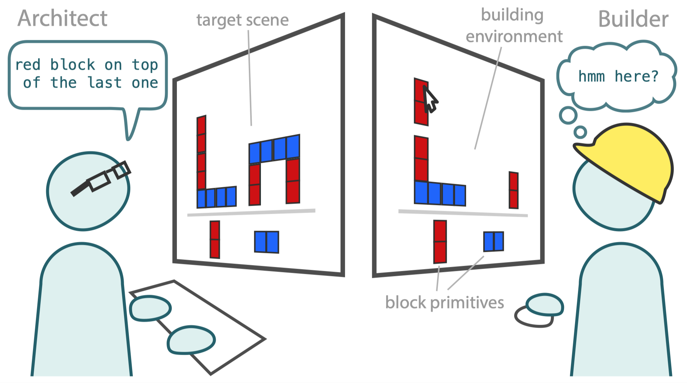
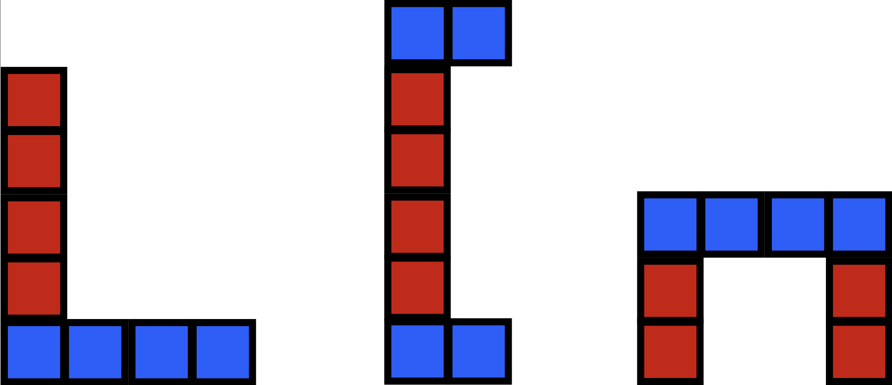

# Compositional Abstractions Tutorial

Welcome!

The goal of this project is to explore changes in language as people learn to communicate about a shared procedural task-- reconstructing a scene of block towers. In particular, we aim to model the learning of *procedural abstractions* using *program synthesis* and subsequent communication about them using a *Bayesian model of convention formation*. This tutorial is based on work we presented at the 2021 Cognitive Science Conference. You can find the paper [here](https://cogtoolslab.github.io/pdf/mccarthy_cogsci_2021b.pdf) if you would like to read more about it.

We recommend reading this intro before diving into the tutorial. Here you will find a more detailed description of the experiment and a high-level overview of the analyses and model. The tutorial itself is split across three jupyter notebooks, which you can find in the `notebooks` folder.

## Experiment

In our experiment, participants were paired up and assigned the role of Architect or Builder. Their shared goal was to accurately recreate target scenes consisting of two block towers.

  </img> 

*Architects* were shown the target scenes. They had to sent text instructions to the Builder, explaining how to construct the current scene.  
*Builders* could not see the scenes. They followed the Architect's instructions by placing blocks in a Building environment.

Architects and Builders worked together over 4 repetitions of 3 tower pairs, where each pair of tower was taken from the following three:

  </img> 

This meant that dyads (pairs) gained shared experience constructing the same tower multiple times. In the [first notebook](/notebooks/ca_language.ipynb), you will analyze Architects' language to show that it becomes more abstract over repetitions. If all goes to plan, you will uncover the emergence of words referring to larger entities in the scenes, in particular to the three block towers that recurred across scenes.

## Model

Our computational model consists of two key steps. Both rely on *programmatic representations* of construction procedures. Representing procedures as programs allows us to capture the hierarchical structure of the scenes, and model learning of part concepts as the addition of *program fragments* to a library of reusable subroutines. Learning these abstractions allows scene programs to be rewritten more concisely. In the [second notebook](/notebooks/ca_programs.ipynb), we show how this process can be implemented using a specific program abstraction algorithm.

The second key component of our model is a Bayesian model of convention formation. The crucial idea here is that, even if someone is able to internally represent a scene in a concise way, they will only choose to *communicate* in this concise form if they have reason to believe that their partner will understand them. In the [third notebook](/notebooks/ca_conventions.ipynb), we explore how people may trade-off between concision and informativity of their language, by modeling how people form ad-hoc conventions for referring to learned abstractions.

## Tutorial

This tutorial is split across three notebooks.

- [Notebook 1: Exploring abstraction in language about building](/notebooks_complete/1_ca_language_complete.ipynb)
- [Notebook 2: Learning part concepts with program abstractions](/notebooks_complete/2_ca_programs_complete.ipynb)
- [Notebook 3: Forming conventions to talk about shared abstractions](/notebook_complete/3_ca_conventions_complete.ipynb)

Each can be tackled separately, however, they are designed to be run in order.

## Installation

1. Clone this repo.
2. (optional but makes life easier) 
   1. Create a virtual env: `python3 -m venv ca_tutorial`
   2. Activate it: `source ca_tutorial/bin/activate`
   3. Install dependencies: `pip install -r requirements.txt`
   4. Install new kernel for jupyter notebook  `python -m ipykernel install --user --name=ca_env`
   5. In the directory for this project run `jupyter notebook` > change kernel to `ca_tut`.
3. Open [Notebook 1](/notebooks/ca_language.ipynb).
